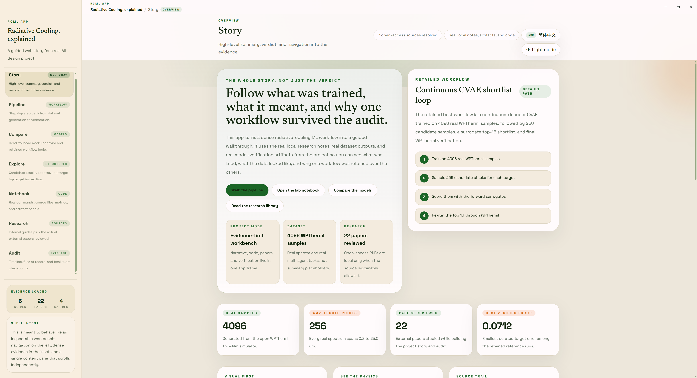
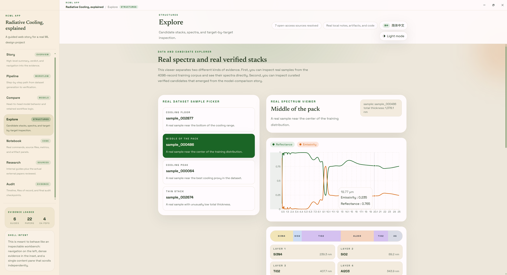
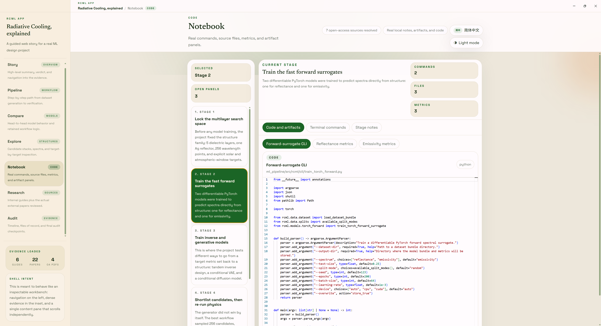
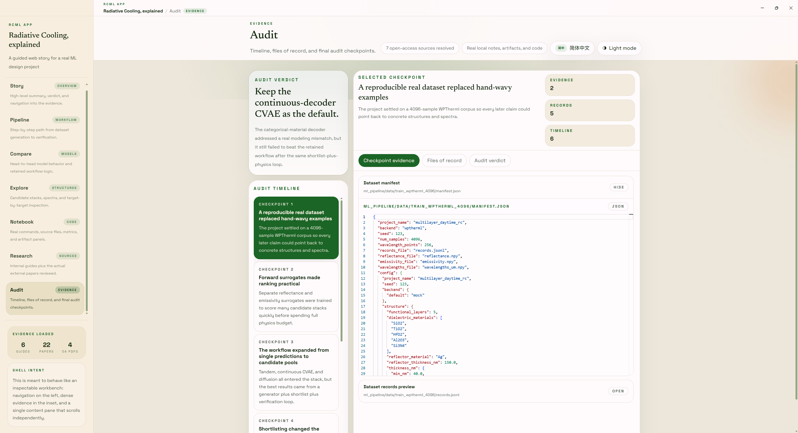

# radia-cooling

> 一个把 **辐射制冷研究流程** 做成可读、可查、可复现实验台的项目。  
> 不只是“跑模型”，而是把数据、训练、候选设计、仿真回验、文献证据串成一条完整链路。


## 这项目在干嘛？

核心目标很直接：  
在多层膜辐射制冷设计中，用机器学习把“昂贵仿真 + 人工试错”变成“可规模化搜索 + 保守验证”。

项目分三块：

- `ml_pipeline/`：数据生成、前向代理模型、逆向生成模型、候选重排与验证
- `app/`：可视化工作台（Story / Pipeline / Compare / Explore / Notebook / Research / Audit）
- `research/`：论文拆解、模型说明、审计报告和外部文献索引

## 项目看点（不是花架子版）

- **Evidence-first**：页面里展示的是本地真实产物，不是写死的 demo 文案  
- **闭环设计**：生成候选后会回到物理仿真再验，不把代理模型当“真值”  
- **多路线并行**：RF / XGBoost / MLP / Tandem / CVAE / Diffusion 都能放在同一评估框架里比较  
- **研究可读性高**：技术细节、代码入口、实验结论和文献来源都能沿着路径追溯

## Examples

| Home / Story | Pipeline |
|---|---|
|  |  |

| Explorer | Research / Audit |
|---|---|
|  |  |

## 快速启动

### 1) Python pipeline

```bash
cd ml_pipeline
python -m venv .venv
source .venv/bin/activate  # Windows: .venv\Scripts\activate
pip install -e ".[train]"
```

### 2) 前端 app

```bash
cd app
npm install
```

### 3) 生成内容并启动界面

```bash
cd ..
python app/scripts/generate_content.py
cd app && npm run dev
```

## 一个建议的阅读顺序

1. 先看 `app` 的 **Story / Pipeline**，搞清楚方法链路  
2. 再去 **Compare / Explore** 看模型和候选结构表现  
3. 最后进 **Notebook / Research / Audit** 对照代码与证据细节

---

如果你在做辐射制冷方向，这个仓库更像一个“可验证研究工作台”，而不只是一个训练脚本集合。
